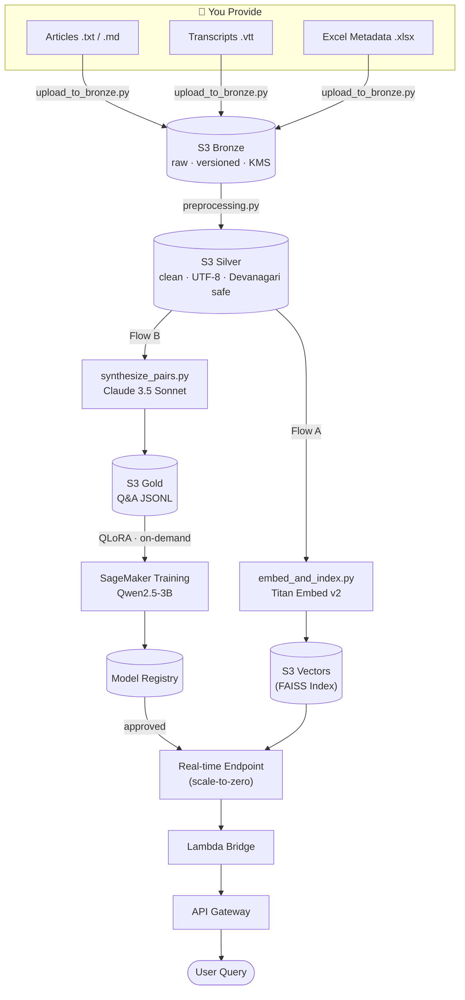
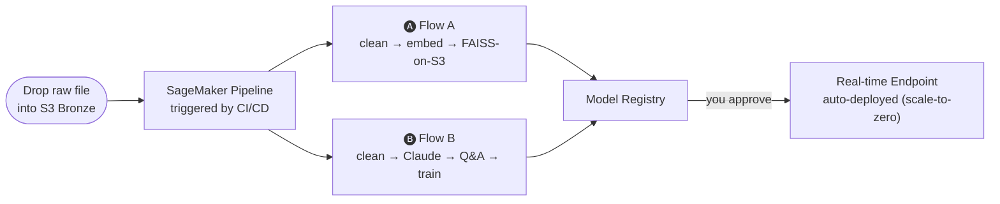

# 🎨 Project Chitrakatha
### A Bilingual Indian Comic History LLM Platform

> *"Chitrakatha"* (चित्रकथा) — Sanskrit for *illustrated story*.  
> A production-grade, **100% Serverless** MLOps platform that fine-tunes an LLM into an expert on the Golden Age of Indian comic books — answering questions in **English and Hindi (Devanagari)**.

[](https://aws.amazon.com)
[](https://python.org)
[](#cost-model)

---

## 🌐 Overview

Project Chitrakatha trains an LLM to be a domain expert on **Raj Comics, Diamond Comics, Indrajal, Tinkle**, and more — covering characters like Nagraj, Super Commando Dhruva, Doga, and Chacha Chaudhary.

Key properties:
- **Bilingual:** Handles queries in English and Devanagari Hindi
- **Serverless:** No persistent EC2, no standing vector DB — Scale-to-Zero cost model
- **Self-improving:** Drop raw articles or transcripts in → the pipeline auto-generates training data and re-trains
- **Traceable:** Full data-to-model lineage via SageMaker native features

---

## 🏗️ System Architecture



---

## 🤖 Models Used

| # | Model | Provider | Role | When |
|---|---|---|---|---|
| 1 | **Titan Embed Text v2** | Amazon Bedrock | Converts text → 1024-dim vectors | Ingestion + every query |
| 2 | **Claude 3.5 Sonnet** | Amazon Bedrock | Teacher: auto-generates bilingual **RAFT training data** (Q + golden doc + distractors + chain-of-thought) | Pipeline run only |
| 3 | **Qwen2.5-3B-Instruct** | HuggingFace Hub (Apache 2.0) | Student: fine-tuned with QLoRA on Gold Q&A — downloaded anonymously, no token or EULA required | Training only |
| 4 | **Fine-tuned Qwen2.5-3B** | SageMaker (yours) | Serves user queries with RAG grounding via real-time GPU endpoint (scale-to-zero) | On demand |

---

## 📂 Data Flow — What You Actually Do



> **You never write Q&A pairs manually.** The pipeline handles all data transformation.

---

## 🛠️ Tech Stack

| Layer | Technology | Why |
|---|---|---|
| **Orchestration** | SageMaker Pipelines | CI/CD/CT (Continuous Training) as a DAG |
| **Data Lake** | Amazon S3 (Bronze/Silver/Gold) | Multi-tier, versioned, KMS-encrypted |
| **Vector Store** | S3 (FAISS Index) | Production-ready serverless RAG (Scale-to-Zero) |
| **Embeddings** | Bedrock Titan Embed v2 | Serverless, 1024-dim, multilingual |
| **Teacher Model** | Bedrock Claude 3.5 Sonnet | Auto-synthesises bilingual training data |
| **Fine-tuning** | QLoRA (PEFT + TRL) on SageMaker | Efficient 4-bit tuning using **RAFT** on ml.g4dn.xlarge (on-demand) |
| **Serving** | SageMaker Real-time Inference + App Auto Scaling | GPU endpoint (ml.g4dn.xlarge); scales to 0 instances when idle |
| **Bridge** | AWS Lambda + API Gateway | Lightweight HTTP interface |
| **IaC** | Terraform | Fully reproducible; outputs drive all config |
| **CI/CD** | GitHub Actions | Lint, test, plan, and trigger pipeline |
| **Encryption** | AWS KMS (Customer Managed Keys) | On every S3 bucket |
| **Secrets** | AWS Secrets Manager | No hardcoded credentials anywhere |

---

## 💰 Cost Model

| Component | Cost | Notes |
|---|---|---|
| S3 storage | ~$0.50/mo | Versioned; lifecycle policies archive old data |
| KMS CMK | ~$1.00/mo | Customer-managed key + API calls |
| CloudWatch Dashboard | ~$3.00/mo | 3 alarms + 1 dashboard |
| Secrets Manager | ~$0.40/mo | 1 secret |
| Bedrock embeddings | ~$0.10/run | Titan Embed v2: $0.00002/1K tokens |
| Bedrock synthesis | ~$1–3/run | Claude 3.5 Sonnet per pipeline execution |
| SageMaker training | ~$0.37–0.74/run | g4dn.xlarge on-demand (~$0.74/hr); 3B model ~30-45 min |
| SageMaker evaluation | ~$0.12–0.25/run | g4dn.xlarge on-demand; 3B model evaluates in ~10 min |
| Real-time endpoint | $0 idle | Scales to 0 via App Auto Scaling; ~$0.74/hr when active |
| **Baseline monthly** | **~$5** | When endpoint is idle and not actively retraining |

---

## 📁 Repository Structure

```
sagemaker-project-chitrakatha/
├── docs/
│   └── IMPLEMENTATION_PLAN.md   # Detailed phase-by-phase build plan
├── infra/terraform/             # All AWS infrastructure (IaC)
├── src/chitrakatha/             # Core Python library
│   ├── config.py                # Pydantic v2 settings (no hardcoded values)
│   ├── exceptions.py            # Custom exception hierarchy
│   ├── ingestion/               # Chunker, embedder, FAISS indexer
│   └── monitoring/              # SageMaker Experiments & Lineage helpers
├── pipeline/
│   ├── pipeline.py              # SageMaker Pipeline DAG definition
│   └── steps/                   # Individual pipeline step scripts
├── serving/
│   ├── inference.py             # RAG model server
│   └── lambda/handler.py        # API Gateway bridge (language-aware)
├── data/scripts/                # Data ingestion & synthesis utilities
└── tests/                       # Unit + integration tests (moto-mocked)
```

---

## 🔒 Security Posture

- **Encryption at rest:** AWS KMS Customer Managed Keys on all S3 buckets
- **IAM:** Least-privilege, resource-scoped policies — no wildcards
- **Secrets:** AWS Secrets Manager only — zero hardcoded credentials
- **Networking:** All inter-service calls stay within the AWS network
- **Data versioning:** S3 bucket versioning enabled — fully reproducible training runs
- **Tagging:** Every resource tagged `Project: Chitrakatha`, `CostCenter: MLOps-Research`

---

## 📋 Implementation Status

See [`docs/IMPLEMENTATION_PLAN.md`](docs/IMPLEMENTATION_PLAN.md) for the detailed phase-by-phase plan.

| Phase | Description | Status |
|---|---|---|
| Phase 0 | Repo scaffold & governance | ✅ Complete |
| Phase 1 | Terraform IaC | ✅ Complete |
| Phase 2 | Data layer (FAISS-on-S3) | ✅ Complete |
| Phase 3 | SageMaker MLOps pipeline | ✅ Complete |
| Phase 4 | Serving (FAISS-on-S3) | ✅ Complete |
| Phase 5 | Observability & lineage | ✅ Complete |
| Phase 6 | CI/CD (GitHub Actions) | ✅ Complete |

---

## 🗺️ Domain Coverage

Comics and publishers in scope:

| Publisher | Characters |
|---|---|
| **Raj Comics** | Nagraj, Super Commando Dhruva, Doga, Bhokal, Tiranga |
| **Diamond Comics** | Chacha Chaudhary, Billu, Pinki, Raman |
| **Indrajal Comics** | Phantom, Mandrake, Flash Gordon |
| **Tinkle (ACK Media)** | Suppandi, Shikari Shambu, Tantri the Mantri |
| **Amar Chitra Katha** | Mythology & historical adaptations |
