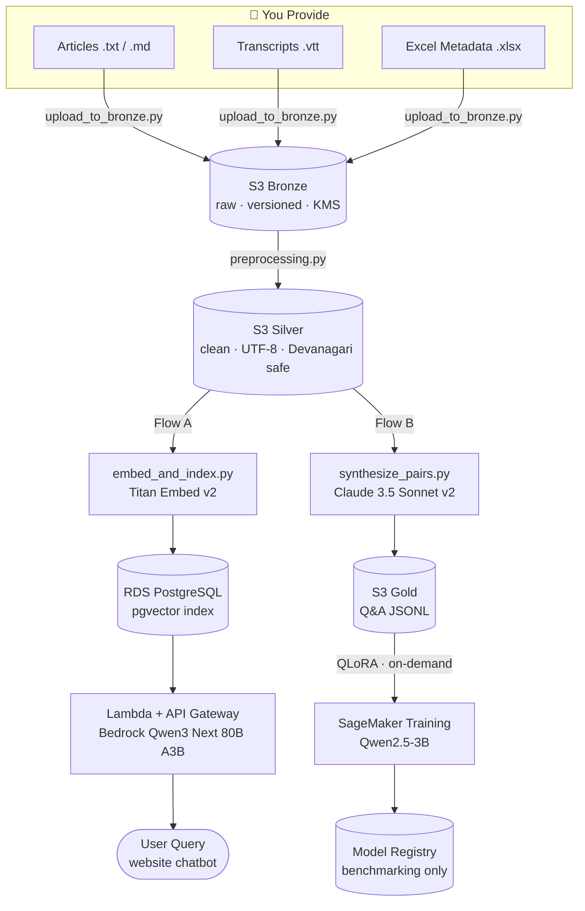
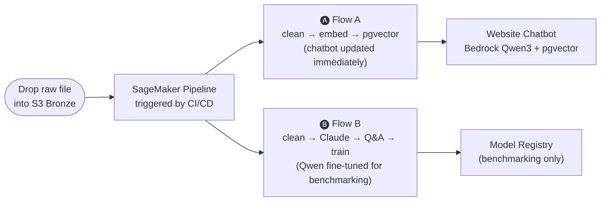

# 🎨 Project Chitrakatha
### A Bilingual Indian Comic History LLM Platform

> *"Chitrakatha"* (चित्रकथा) — Sanskrit for *illustrated story*.
> A production-grade MLOps platform that fine-tunes an LLM into an expert on the Golden Age of Indian comic books — answering questions in **English and Hindi (Devanagari)**. Website chatbot powered by **Bedrock Qwen3 Next 80B A3B + pgvector RAG** (always-on, no cold start). Fine-tuned Qwen2.5-3B retained for benchmarking and MLOps learning.

[](https://aws.amazon.com)
[](https://python.org)
[](#-cost-model)

---

## 🌐 Overview

Project Chitrakatha trains an LLM to be a domain expert on **Raj Comics, Diamond Comics, Indrajal, Tinkle**, and more — covering characters like Nagraj, Super Commando Dhruva, Doga, and Chacha Chaudhary.

Key properties:
- **Bilingual:** Handles queries in English and Devanagari Hindi
- **No cold start:** Website chatbot uses Bedrock Qwen3 + pgvector — always responsive
- **Self-improving:** Drop raw articles or transcripts in → the pipeline auto-updates the RAG knowledge base immediately and optionally retrains the fine-tuned model
- **Traceable:** Full data-to-model lineage via SageMaker native features
- **Two-speed architecture:** RAG index updated on every data drop (minutes); Qwen fine-tuning run monthly for benchmarking

---

## 🏗️ System Architecture



---

## 🤖 Models Used

| # | Model | Provider | Role | When |
|---|---|---|---|---|
| 1 | **Titan Embed Text v2** | Amazon Bedrock | Converts text → 1024-dim vectors | Ingestion + every query |
| 2 | **Claude 3.5 Sonnet v2** | Amazon Bedrock | Teacher: auto-generates bilingual **RAFT training data** (Q + golden doc + distractors + chain-of-thought) | Pipeline run only |
| 3 | **Qwen2.5-3B-Instruct** | S3 cache → SageMaker (Apache 2.0) | Student: fine-tuned with QLoRA on Gold Q&A — cached in S3 Gold, no HuggingFace runtime dependency | Training only |
| 4 | **Qwen3 Next 80B A3B** | Amazon Bedrock (`qwen.qwen3-next-80b-a3b`) | Serves all website queries with pgvector RAG grounding — no cold start, pay per token, strong Hindi natively | Every user query |

---

## 📂 Data Flow — What You Actually Do



> **You never write Q&A pairs manually.** The pipeline handles all data transformation.
> **Flow A** powers the live chatbot. **Flow B** trains the fine-tuned model for quality measurement.

---

## 🛠️ Tech Stack

| Layer | Technology | Why |
|---|---|---|
| **Orchestration** | SageMaker Pipelines | CI/CD/CT (Continuous Training) as a DAG |
| **Data Lake** | Amazon S3 (Bronze/Silver/Gold) | Multi-tier, versioned, KMS-encrypted |
| **Vector Store** | pgvector on RDS PostgreSQL | Hybrid search (vector + SQL filters), always-on, no cold start for RAG |
| **Embeddings** | Bedrock Titan Embed v2 | Serverless, 1024-dim, multilingual |
| **Synthesis** | Bedrock Claude 3.5 Sonnet v2 | Auto-synthesises bilingual RAFT training data |
| **Fine-tuning** | QLoRA (PEFT + TRL) on SageMaker | Efficient 4-bit tuning using **RAFT** on ml.g4dn.xlarge (on-demand) |
| **Chatbot Serving** | Bedrock Qwen3 Next 80B A3B + pgvector RAG | No GPU cold start; pay per token; strong Hindi; works in ap-southeast-2 |
| **Benchmarking** | SageMaker Real-time Endpoint (on-demand) | Fine-tuned Qwen2.5-3B deployed on-demand to compare quality vs Qwen3 RAG |
| **Bridge** | AWS Lambda (in VPC) + API Gateway | Lightweight HTTP interface; session_id + history contract ready for multi-turn |
| **Networking** | Private VPC + VPC Endpoints (Bedrock + Secrets Manager) | No NAT Gateway; RDS in private subnet; Lambda reaches Bedrock via VPC endpoint |
| **IaC** | Terraform | Fully reproducible; outputs drive all runtime config |
| **CI/CD** | GitHub Actions | Lint, test, plan, ECR image build, and pipeline trigger |
| **Encryption** | AWS KMS (Customer Managed Keys) | On every S3 bucket and RDS instance |
| **Secrets** | AWS Secrets Manager | No hardcoded credentials anywhere |

---

## 💰 Cost Model

### Standing costs (always running)

| Component | AUD/month | Notes |
|---|---|---|
| RDS PostgreSQL (`db.t4g.micro`) | ~$20 | pgvector; private subnet; KMS-encrypted |
| VPC Endpoints (Bedrock + Secrets Manager) | ~$16 | Interface endpoints; no NAT Gateway needed |
| KMS CMK | ~$3 | Customer-managed key + API calls |
| CloudWatch | ~$5 | 3 alarms + 1 dashboard |
| Secrets Manager | ~$1 | 2 secrets (API key + RDS credentials) |
| S3 storage | ~$1 | 3 buckets; versioned; lifecycle policies |
| ECR image storage | ~$2 | Custom training container |
| **Baseline monthly** | **~$48** | When not actively retraining |

### Per pipeline run (when fine-tuning, ~monthly)

| Component | AUD/run |
|---|---|
| Titan Embed (Flow A) | ~$0.10 |
| Claude 3.5 Sonnet v2 synthesis (Flow B) | ~$2.00 |
| SageMaker training (g4dn.xlarge, ~45 min) | ~$1.50 |
| SageMaker evaluation | ~$0.50 |
| **Per run total** | **~$4** |

### Per query (website chatbot)

| Volume | AUD/month |
|---|---|
| 500 queries | ~$0.50 |
| 2,000 queries | ~$2 |
| 10,000 queries | ~$10 |

---

## 📁 Repository Structure

```
sagemaker-project-chitrakatha/
├── docs/
│   ├── IMPLEMENTATION_PLAN.md       # Detailed phase-by-phase build plan
│   └── ARCHITECTURAL_DECISIONS.md   # All key decisions, cost model, cleanup checklist
├── infra/terraform/                 # All AWS infrastructure (IaC)
│   ├── networking.tf                # VPC + private subnets + VPC endpoints
│   ├── rds.tf                       # RDS PostgreSQL + pgvector + security groups
│   └── pgvector.tf                  # pgvector schema init
├── src/chitrakatha/                 # Core Python library
│   ├── config.py                    # Pydantic v2 settings (no hardcoded values)
│   ├── exceptions.py                # Custom exception hierarchy
│   ├── ingestion/                   # Chunker, embedder, pgvector writer
│   └── monitoring/                  # SageMaker Experiments & Lineage helpers
├── pipeline/
│   ├── pipeline.py                  # SageMaker Pipeline DAG definition
│   ├── Dockerfile                   # Custom ECR training image (deps pre-baked)
│   ├── requirements.txt             # Exact-pinned training dependencies
│   └── steps/                       # Individual pipeline step scripts
├── serving/
│   ├── inference.py                 # pgvector retrieval + Bedrock Qwen3 generation
│   ├── deploy_endpoint.py           # On-demand benchmarking endpoint deploy
│   └── lambda/handler.py            # API Gateway bridge (language-aware, VPC)
├── data/scripts/                    # Data ingestion & synthesis utilities
└── tests/                           # Unit + integration tests (moto-mocked)
```

---

## 🔒 Security Posture

- **Encryption at rest:** AWS KMS Customer Managed Keys on all S3 buckets and RDS instance
- **IAM:** Least-privilege, resource-scoped policies — no wildcards
- **Secrets:** AWS Secrets Manager only — zero hardcoded credentials
- **Networking:** RDS in private subnet; Lambda in VPC; all Bedrock calls via VPC Interface Endpoint — no traffic leaves AWS network
- **Data versioning:** S3 bucket versioning enabled — fully reproducible training runs
- **Tagging:** Every resource tagged `Project: Chitrakatha`, `CostCenter: MLOps-Research`

---

## 📋 Implementation Status

See [`docs/IMPLEMENTATION_PLAN.md`](docs/IMPLEMENTATION_PLAN.md) for the detailed phase-by-phase plan.
See [`docs/ARCHITECTURAL_DECISIONS.md`](docs/ARCHITECTURAL_DECISIONS.md) for all key decisions and the cleanup checklist.

| Phase | Description | Status |
|---|---|---|
| Phase 0 | Repo scaffold & governance | ✅ Complete |
| Phase 1 | Terraform IaC (base) | ✅ Complete |
| Phase 2 | Data layer | ✅ Complete |
| Phase 3 | SageMaker MLOps pipeline | ✅ Complete |
| Phase 4 | Serving (original FAISS + Qwen endpoint) | ✅ Complete |
| Phase 5 | Observability & lineage | ✅ Complete |
| Phase 6 | CI/CD (GitHub Actions) | ✅ Complete |
| **Phase 7** | **Architecture migration: pgvector + Bedrock Qwen3 Next 80B A3B** | 🔄 In Progress |

### Phase 7 — Migration Checklist

- [ ] Terraform: RDS PostgreSQL + pgvector + private VPC (Option B)
- [ ] Pipeline Flow A: replace FAISS writer with pgvector writer
- [ ] Serving: rewrite `inference.py` (pgvector retrieval + Bedrock Qwen3 Next 80B A3B)
- [ ] Serving: update Lambda `handler.py` (new contract + VPC config)
- [ ] Fine-tuning: add `pipeline/Dockerfile` (custom ECR training image)
- [ ] Fine-tuning: update `pipeline.py` for S3 model cache (`SM_CHANNEL_MODEL`)
- [ ] Cleanup: remove S3 Vectors bucket, `faiss_index.tf`, `faiss_writer.py`, `deploy_endpoint.py` from live path

---

## 🗺️ Domain Coverage

Comics and publishers in scope:

| Publisher | Characters |
|---|---|
| **Raj Comics** | Nagraj, Super Commando Dhruva, Doga, Bhokal, Tiranga |
| **Diamond Comics** | Chacha Chaudhary, Billu, Pinki, Raman |
| **Indrajal Comics** | Phantom, Mandrake, Flash Gordon |
| **Tinkle (ACK Media)** | Suppandi, Shikari Shambu, Tantri the Mantri |
| **Amar Chitra Katha** | Mythology & historical adaptations |
