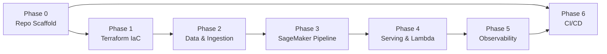

> **Goal:** A production-grade, 100% Serverless, bilingual (English/Devanagari) Indian Comic History LLM platform on AWS using FAISS-on-S3 (Production RAG), Bedrock, and SageMaker — with a "Scale-to-Zero" cost model (~$5/mo baseline).

---

## Quick Reference: Guiding Constraints

| Constraint | Rule |
|---|---|
| Language | Python 3.12+, strict type hints, pydantic v2 |
| Encoding | UTF-8 everywhere; never strip Devanagari |
| Compute | 100% Serverless (no EC2 / EKS / persistent DB) |
| Secrets | AWS Secrets Manager only — no hardcoding |
| IaC | Terraform (primary) — outputs drive all runtime config |
| Encryption | AWS-KMS CMKs on every S3 bucket |
| IAM | Least-privilege, resource-scoped policies |
| Training | On-demand ml.g4dn.xlarge (Spot quota is 0 by default in ap-southeast-2); checkpointing retained |
| Tagging | `Project: Chitrakatha`, `CostCenter: MLOps-Research` on every resource |
| Chunking | Sliding window, 15% overlap for narrative continuity |
| Versioning | S3 bucket versioning enabled on all data buckets |

---

## Phase 0 — Repository Scaffold & Governance

**Goal:** Establish the project skeleton, Python toolchain, and pre-commit quality gates before writing any domain code.

### Files to Create

#### `pyproject.toml` [NEW]
- Python 3.12 project config
- Dependencies: `boto3`, `sagemaker`, `pydantic>=2`, `transformers`, `peft`, `trl`, `datasets`, `bitsandbytes`, `yt-dlp`, `openpyxl`, `pytest`, `ruff`, `mypy`
- Dev deps: `moto[s3,bedrock,secretsmanager]`, `pytest-cov`

#### `.python-version` [NEW]
- Pin to `3.12`

#### `.pre-commit-config.yaml` [NEW]
- Hooks: `ruff` (lint + format), `mypy` (type check), `detect-secrets`, `terraform fmt`

#### `Makefile` [NEW]
- Targets: `install`, `lint`, `test`, `tf-plan`, `tf-apply`, `pipeline-run`

#### `src/chitrakatha/__init__.py` [NEW]
- Package init; exposes `__version__`

#### `src/chitrakatha/config.py` [NEW]
- Pydantic v2 `BaseSettings` model: reads `AWS_REGION`, `S3_BUCKET_PREFIX`, `KMS_KEY_ARN`, `SAGEMAKER_ROLE_ARN`, `S3_VECTOR_INDEX_NAME` from environment / SSM
- No hardcoded values

#### `src/chitrakatha/exceptions.py` [NEW]
- Custom exception hierarchy:
  - `ChitrakathaBaseError`
  - `SageMakerPipelineError(ChitrakathaBaseError)`
  - `BedrockEmbeddingError(ChitrakathaBaseError)` — Titan embedding API failures
  - `BedrockSynthesisError(ChitrakathaBaseError)` — Claude RAFT synthesis failures
  - `S3VectorError(ChitrakathaBaseError)`
  - `DataIngestionError(ChitrakathaBaseError)`

#### `README.md` [NEW]
- Architecture diagram (ASCII), quick-start, cost breakdown

#### `tests/__init__.py`, `tests/unit/__init__.py`, `tests/integration/__init__.py` [NEW]
- Empty init files

---

## Phase 1 — Infrastructure-as-Code (Terraform)

**Goal:** Provision all AWS primitives. Every downstream Python script derives config from Terraform outputs — no hardcoded ARNs.

### Directory: `infra/terraform/`

#### `infra/terraform/main.tf` [NEW]
- Provider: `aws` pinned to `~> 5.x`
- Terraform backend: S3 state bucket + DynamoDB lock table (bootstrap script)

#### `infra/terraform/variables.tf` [NEW]
- `aws_region`, `project_name` (default: `chitrakatha`), `environment` (default: `dev`)

#### `infra/terraform/kms.tf` [NEW]
- **Customer Managed Key** for all S3 buckets
- Key policy: least-privilege (SageMaker role, Bedrock service principal)
- Tags: `Project: Chitrakatha`, `CostCenter: MLOps-Research`

#### `infra/terraform/s3.tf` [NEW]
Provisions **4 S3 buckets** with versioning + KMS + lifecycle:
1. `chitrakatha-bronze-{account_id}` — raw ingest (articles, transcripts, Excel)
2. `chitrakatha-silver-{account_id}` — cleaned JSONL
3. `chitrakatha-gold-{account_id}` — training-ready datasets + model artifacts
4. `chitrakatha-vectors-{account_id}` — **FAISS Index** bucket

#### `infra/terraform/faiss_index.tf` [NEW]
- **FAISS Index URI Placeholder**
- Defines the S3 URI where the FAISS index will be written and read from.
- Links to vectors bucket.

#### `infra/terraform/iam.tf` [NEW]
- **SageMaker Execution Role** with least-privilege inline policies:
  - S3: `GetObject`, `PutObject`, `ListBucket` scoped to the 4 named buckets only
  - Bedrock: `InvokeModel` on Titan Embed v2 ARN only
  - SageMaker: `CreateProcessingJob`, `CreateTrainingJob`, `CreateModel`, `CreateEndpointConfig`, `CreateEndpoint`
  - KMS: `GenerateDataKey`, `Decrypt` scoped to CMK ARN
  - Secrets Manager: `GetSecretValue` scoped to `chitrakatha/*`
  - CloudWatch Logs: `CreateLogGroup`, `PutLogEvents`

#### `infra/terraform/secrets.tf` [NEW]
- AWS Secrets Manager secret: `chitrakatha/synthetic_data_api_key`
- Placeholder value — real value injected via CI/CD

#### `infra/terraform/outputs.tf` [NEW]
- Exports: `sagemaker_role_arn`, `kms_key_arn`, `s3_bronze_bucket`, `s3_silver_bucket`, `s3_gold_bucket`, `s3_vectors_bucket`, `s3_faiss_index_prefix`, `secret_arn`

#### `infra/terraform/cloudwatch.tf` [NEW]
- CloudWatch Alarms:
  - Serverless endpoint `ModelInvocationErrors` > 5 in 5 min → SNS alert
  - Serverless endpoint cold-start latency P99 > 30s → SNS alert
  - 4xx/5xx error rate > 1% → SNS alert

---

## Phase 2 — Data Layer & Ingestion Pipeline

**Goal:** Accept raw source material only — the pipeline handles everything else. Two parallel flows serve different purposes: **Flow A** builds the RAG knowledge base; **Flow B** auto-generates fine-tuning training pairs from that same corpus via Claude.

> [!NOTE]
> **You never write Q&A pairs manually.** You drop raw data in. Claude reads each chunk and synthesises bilingual training examples automatically.

### Data Sources (what you provide)

| Source type | Format | Drop location |
|---|---|---|
| Comic wiki / blog articles | `.txt`, `.md` | `s3://chitrakatha-bronze/articles/` |
| YouTube transcripts | `.vtt`, `.txt` | `s3://chitrakatha-bronze/transcripts/` |
| Excel metadata sheets | `.xlsx` | `s3://chitrakatha-bronze/metadata/` |
| Scanned comic synopsis | `.txt` (UTF-8) | `s3://chitrakatha-bronze/synopsis/` |

### Sub-phase 2a: Raw Ingestion → S3 Bronze

#### `data/scripts/upload_to_bronze.py` [NEW]
- Generic S3 upload utility for all raw source types above
- Validates UTF-8 encoding before upload; preserves Devanagari
- Computes MD5 checksum stored in S3 object metadata for lineage
- Supported parsers: plain text, `.vtt` (strips timestamps), `.xlsx` (via `openpyxl`)

### Sub-phase 2b: Preprocessing & Dual-Flow Split

After raw data lands in Bronze, **one preprocessing job** produces two outputs:

```
S3 Bronze (raw)
      │
  preprocessing.py
      │
      ├──► S3 Silver /corpus/     ← Flow A: clean chunks for RAG
      └──► S3 Silver /training/   ← Flow B: input for Q&A synthesis
```

### Sub-phase 2c: Flow A — Corpus → FAISS-on-S3 (RAG knowledge base)

#### `src/chitrakatha/ingestion/chunker.py` [NEW]
- **Sliding-window chunker** with 15% overlap
- Configurable `chunk_size` (default: 512 tokens) and `overlap_ratio` (default: 0.15)
- Preserves Devanagari; never strips non-ASCII
- Returns `list[Chunk]` where `Chunk` is a pydantic v2 model

#### `src/chitrakatha/ingestion/embedder.py` [NEW]
- Wraps Bedrock `amazon.titan-embed-text-v2:0`
- Batch-embeds chunks (max 25 per API call to stay within limits)
- Raises `BedrockEmbeddingError` on failure
- Returns `list[float]` (1024-dim vectors)

#### `src/chitrakatha/ingestion/faiss_writer.py` [REFAC]
- Writes `(vector_id, embedding, metadata)` to a **FAISS Index** stored in S3.
- Metadata payload: `{"chunk_id": ..., "chunk_text": ..., "source_document": ..., "chunk_index": ..., "token_count": ...}`
- Supports incremental updates by downloading existing index, appending, and re-uploading.
- Raises `S3VectorError` on failure.

#### `data/scripts/ingest_to_faiss.py` [NEW]
- Orchestration: reads `/corpus/` chunks from Silver → chunk → embed → write FAISS index to S3
- Idempotent: checks for existing vector IDs before re-inserting
- Runs as a **SageMaker Processing Job** (see Phase 3)

### Sub-phase 2d: Flow B — Corpus → RAFT Training Data → Fine-tuning

> **Technique: RAFT (Retrieval-Augmented Fine-Tuning)**  
> The model is trained not just on Q&A facts, but on examples that include a golden document *and* distractor documents. This teaches the model the skill of reading retrieved context and ignoring irrelevant chunks — exactly what it must do at inference time against live S3 Vector results.

#### `data/scripts/synthesize_training_pairs.py` [NEW]
- Reads clean corpus chunks from `S3 Silver /training/`
- For each **golden chunk**, randomly samples 2 **distractor chunks** from the same Silver corpus (different entity/publisher)
- Calls **Bedrock Claude** (`anthropic.claude-3-5-sonnet-20241022-v2:0`) with a RAFT prompt:
  > *"You are given a golden document and 2 distractor documents about Indian comics. Generate 3 bilingual Q&A pairs (English + Devanagari Hindi). For each pair, include a chain-of-thought that explicitly identifies which document contains the answer and why the distractors are irrelevant. Ground every answer strictly in the golden document only."*
- Output schema per record:
  ```json
  {
    "id": "uuid4",
    "question_en": "...",
    "question_hi": "... (Devanagari)",
    "golden_chunk": "... (the source passage)",
    "distractor_chunks": ["...", "..."],
    "chain_of_thought": "The question asks about X. Document 1 mentions X explicitly. Documents 2 and 3 are about different characters and are not relevant...",
    "answer_en": "... (grounded in golden_chunk only)",
    "answer_hi": "... (Devanagari, grounded in golden_chunk only)",
    "source_chunk_id": "...",
    "source_entity": "Nagraj",
    "publisher": "Raj Comics",
    "language_pair": "en-hi"
  }
  ```
- Output: JSONL to `S3 Gold /training-pairs/` (grows with every corpus update)
- Raises `BedrockEmbeddingError` on API failure; retries with exponential backoff
- Runs as a **SageMaker Processing Job** after embedding step

> **Cost note:** RAFT examples are ~3–4× larger than plain Q&A pairs (include golden + 2 distractor chunks). Expect ~$3–9/run Bedrock synthesis cost vs ~$1–3 for plain SFT.

---

## Phase 3 — SageMaker MLOps Pipeline (The Core DAG)

**Goal:** Build the automated `Process → Embed → Train → Evaluate → Register` pipeline.

### Sub-phase 3a: Processing Step

#### `pipeline/steps/preprocessing.py` [NEW]
- SageMaker Processing script (runs in `SKLearnProcessor`)
- Input: raw source files from S3 Bronze (articles, transcripts, Excel, synopsis)
- Operations:
  1. Parse source type (`.vtt` → strip timestamps, `.xlsx` → flatten rows, `.txt` → passthrough)
  2. Normalize Unicode (NFC form, **preserve Devanagari** — never strip non-ASCII)
  3. De-duplicate by content hash
  4. Language-tag each document (`en`, `hi`, or `en-hi` bilingual)
  5. Split into two output prefixes:
     - `S3 Silver /corpus/` — clean full-text for RAG embedding (Flow A)
     - `S3 Silver /training/` — clean chunks as synthesis input (Flow B)
- Raises `DataIngestionError` on unreadable or completely empty documents

### Sub-phase 3b: Embedding Step (Flow A)

#### `pipeline/steps/embed_and_index.py` [NEW]
- SageMaker Processing script
- Reads `S3 Silver /corpus/` → chunk → embed → write FAISS index to S3
- Calls `ingest_to_faiss.py` logic (idempotent)
- Logs vector count to SageMaker Experiments

### Sub-phase 3b-ii: Training Pair Synthesis Step (Flow B)

#### `pipeline/steps/synthesize_pairs.py` [NEW]
- SageMaker Processing script wrapping `synthesize_training_pairs.py`
- Reads `S3 Silver /training/` corpus chunks
- Claude generates 3 bilingual Q&A pairs per chunk
- Outputs to `S3 Gold /training-pairs/`
- Logs pair count and Bedrock token usage to SageMaker Experiments
- **Runs in parallel with `embed_and_index.py`** (no dependency between Flow A and Flow B)

### Sub-phase 3c: Fine-tuning Step

#### `pipeline/steps/train.py` [NEW]
- **QLoRA fine-tuning** using `trl.SFTTrainer` + `peft` with **RAFT prompt template**
- Base model: `meta-llama/Meta-Llama-3.1-8B-Instruct` via **SageMaker JumpStart** (`meta-textgeneration-llama-3-1-8b-instruct`) — weights delivered to `SM_CHANNEL_MODEL`, no HuggingFace token required
- LoRA config: `r=16`, `lora_alpha=32`, `target_modules=["q_proj","v_proj"]`, `lora_dropout=0.05`
- Quantization: 4-bit `BitsAndBytesConfig` (NF4)
- **RAFT prompt template** applied to every training example:
  ```
  You are given the following documents:
  [Document 1 - may or may not be relevant]: {distractor_1}
  [Document 2 - may or may not be relevant]: {golden_chunk}
  [Document 3 - may or may not be relevant]: {distractor_2}

  Question: {question}

  Think step by step, then answer using ONLY the relevant document above.
  {chain_of_thought}
  Answer: {answer}
  ```
  > Documents are shuffled randomly so the model cannot learn positional shortcuts.
- **On-demand training**: `use_spot_instances=False` (default Spot quota is 0 in ap-southeast-2)
- Checkpointing to S3 Gold (`/checkpoints/`)
- Logs hyperparameters + eval metrics to **SageMaker Experiments** run
- Evaluation: ROUGE-L score on held-out 10% of Gold data

#### `pipeline/steps/evaluate.py` [NEW]
- Standalone evaluation script with **three test suites**:
  1. **Factual accuracy**: ROUGE-L, BERTScore (multilingual), exact-match@1 on held-out Q&A pairs
  2. **Cross-lingual retrieval**: English query → must match Devanagari ground truth answer
  3. **Distractor robustness** *(RAFT-specific)*: Model is given 1 golden + 4 distractor chunks; must still produce the correct answer — tests that the RAFT training generalised
- Emits all metrics to SageMaker Experiments
- Returns `{"status": "pass"/"fail", "rouge_l": float, "distractor_robustness": float}`
- Pass threshold: ROUGE-L ≥ 0.35 **AND** distractor_robustness ≥ 0.70

### Sub-phase 3d: Pipeline DAG

#### `pipeline/pipeline.py` [NEW]
- `sagemaker.workflow.pipeline.Pipeline` definition
- Steps in order:
  1. `ProcessingStep` — runs `preprocessing.py` via `SKLearnProcessor` (splits Bronze → Silver corpus + training)
  2. `ProcessingStep` — runs `embed_and_index.py` (Flow A: corpus → FAISS-on-S3) ┐ run in parallel
  3. `ProcessingStep` — runs `synthesize_pairs.py` (Flow B: chunks → Claude → Gold Q&A) ┘
  4. `TrainingStep` — runs `train.py` via `JumpStartEstimator` (`meta-textgeneration-llama-3-1-8b-instruct`, g5.2xlarge Spot) — reads from Gold Q&A
  5. `ProcessingStep` — runs `evaluate.py`
  6. `ConditionStep` — if ROUGE-L ≥ 0.35 **AND** distractor_robustness ≥ 0.70 → proceed to registration
  7. `ModelStep` — creates SageMaker Model artifact
  8. `RegisterModel` — registers to Model Registry (approval status: `PendingManualApproval`)
- Pipeline parameters: `InputDataUri`, `ModelApprovalStatus`
- Tags: `Project: Chitrakatha`, `CostCenter: MLOps-Research`

#### `pipeline/requirements.txt` [NEW]
- Dependencies for training container: `transformers`, `peft`, `trl`, `datasets`, `bitsandbytes`, `rouge-score`, `bert-score`, `evaluate`, `sentencepiece`
  > `sentencepiece` required for multilingual BERTScore tokenisation across English and Devanagari.

---

## Phase 4 — Serving: Serverless Inference + Lambda Bridge

**Goal:** Deploy the fine-tuned model behind a zero-cost-when-idle serverless endpoint, with a Lambda function providing the RAG query interface.

### Sub-phase 4a: Serverless Endpoint

#### `serving/deploy_endpoint.py` [NEW]
- Reads approved model from SageMaker Model Registry
- Deploys via `ServerlessInferenceConfig`:
  - `MemorySizeInMB=6144`
  - `MaxConcurrency=5`
- Endpoint name: `chitrakatha-rag-serverless`
- Custom **Container Environment**: injects `BEDROCK_KB_ID`, `S3_FAISS_INDEX_PREFIX`

#### `serving/inference.py` [REFAC]
- Model server entry point (`model_fn`, `predict_fn`)
- RAG flow inside `predict_fn`:
  1. Embed query using Bedrock Titan v2
  2. Similarity search against **FAISS index** (cached in memory from S3)
  3. Build prompt: `[Context from retrieved chunks] + [User Query]`
  4. Generate response via the fine-tuned Llama model
- Raises `SageMakerPipelineError` on empty context retrieval

### Sub-phase 4b: Lambda Bridge

#### `serving/lambda/handler.py` [NEW]
- Python 3.12 Lambda function
- API Gateway → Lambda → SageMaker Serverless endpoint
- Input validation via pydantic v2 (`QueryRequest` model)
- Returns `{"answer": str, "sources": list[str], "language": "en"|"hi"}`
- Language detection: if query contains Devanagari chars → respond in Hindi
- Cold-start optimization: reuse boto3 client at module level
- CloudWatch structured logging (JSON)

#### `serving/lambda/requirements.txt` [NEW]
- `boto3`, `pydantic>=2`

#### `infra/terraform/lambda.tf` [NEW]
- Lambda function resource with IAM role (invoke SageMaker endpoint only)
- API Gateway HTTP API trigger
- Environment vars from Terraform outputs (no hardcoding)

---

## Phase 5 — Observability, Lineage & MLOps Governance

**Goal:** Full experiment tracking, data-to-model lineage, and CloudWatch dashboards.

#### `src/chitrakatha/monitoring/lineage.py` [NEW]
- Wraps `sagemaker.lineage` APIs
- Records: `DataSet → ProcessingJob → TrainingJob → Model → Endpoint` lineage chain
- Called from pipeline steps post-execution

#### `src/chitrakatha/monitoring/experiments.py` [NEW]
- Helper to log to **SageMaker Experiments**
- Logs: `base_model`, `lora_r`, `lora_alpha`, `learning_rate`, `epochs`, `rouge_l`, `bert_score`

#### `infra/terraform/cloudwatch.tf` (additions)
- CloudWatch Dashboard: `ChitrakathaMLOpsDashboard`
  - Widgets: endpoint invocations, error rate, cold-start P99, training job status

---

## Phase 6 — CI/CD (GitHub Actions)

**Goal:** Automated quality gates and pipeline triggering on every PR and merge to `main`.

#### `.github/workflows/ci.yml` [NEW]
- Triggers: `push` to `main`, `pull_request`
- Jobs:
  1. **lint-and-type-check**: `ruff check`, `ruff format --check`, `mypy src/`
  2. **unit-tests**: `pytest tests/unit/ -v --cov=src/chitrakatha --cov-fail-under=80`
  3. **terraform-lint**: `terraform fmt -check`, `terraform validate`
  4. **terraform-plan**: on PR only, posts plan output as PR comment

#### `.github/workflows/ct.yml` [NEW]
- Triggers: merge to `main` + manual `workflow_dispatch`
- Job: **trigger-sagemaker-pipeline**
  - Assumes OIDC role (no long-lived keys)
  - Calls `pipeline/pipeline.py --execute`
  - Posts pipeline ARN to Slack/GitHub summary

#### `.github/workflows/deploy.yml` [NEW]
- Triggers: SageMaker Model Registry approval webhook (via EventBridge → Lambda → GitHub Actions API)
- Job: **deploy-endpoint** — runs `serving/deploy_endpoint.py`

---

## Proposed Repository Layout

```
sagemaker-project-chitrakatha/
├── .github/
│   └── workflows/
│       ├── ci.yml
│       ├── ct.yml
│       └── deploy.yml
├── .pre-commit-config.yaml
├── AGENTS.md
├── Makefile
├── README.md
├── pyproject.toml
├── .python-version
│
├── infra/
│   └── terraform/
│       ├── main.tf
│       ├── variables.tf
│       ├── kms.tf
│       ├── s3.tf
│       ├── faiss_index.tf
│       ├── iam.tf
│       ├── secrets.tf
│       ├── cloudwatch.tf
│       ├── lambda.tf
│       └── outputs.tf
│
├── src/
│   └── chitrakatha/
│       ├── __init__.py
│       ├── config.py              # Pydantic v2 settings
│       ├── exceptions.py          # Custom exception hierarchy
│       ├── ingestion/
│       │   ├── chunker.py         # Sliding-window chunker (15% overlap)
│       │   ├── embedder.py        # Bedrock Titan Embed v2 wrapper
│       │   └── faiss_writer.py   # FAISS index writer (S3-backed)
│       └── monitoring/
│           ├── lineage.py         # SageMaker Lineage API helpers
│           └── experiments.py     # SageMaker Experiments logger
│
├── pipeline/
│   ├── pipeline.py                # SageMaker Pipeline DAG
│   ├── requirements.txt
│   └── steps/
│       ├── preprocessing.py       # Step 1: Bronze → Silver (corpus + training split)
│       ├── embed_and_index.py     # Step 2a: Flow A — corpus → FAISS-on-S3
│       ├── synthesize_pairs.py    # Step 2b: Flow B — chunks → Claude → Gold Q&A
│       ├── train.py               # Step 3: QLoRA fine-tune on Gold Q&A
│       └── evaluate.py            # Step 4: ROUGE-L, BERTScore, cross-lingual
│
├── serving/
│   ├── deploy_endpoint.py         # Serverless endpoint deploy script
│   ├── inference.py               # Model server (RAG predict_fn)
│   └── lambda/
│       ├── handler.py             # Lambda bridge (API GW → SageMaker)
│       └── requirements.txt
│
├── data/
│   └── scripts/
│       ├── upload_to_bronze.py          # Drop raw data → S3 Bronze
│       ├── ingest_to_faiss.py          # Flow A: Silver corpus → FAISS-on-S3
│       └── synthesize_training_pairs.py  # Flow B: Silver chunks → Claude → Gold Q&A
│
└── tests/
    ├── unit/
    │   ├── test_chunker.py        # Sliding window logic, Devanagari preservation
    │   ├── test_embedder.py       # Mocked Bedrock calls (moto)
    │   ├── test_preprocessor.py   # Unicode normalization, dedup
    │   ├── test_faiss_writer.py  # Mocked FAISS/S3 (moto)
    │   └── test_lambda_handler.py # Pydantic validation, language detection
    └── integration/
        └── test_pipeline_dag.py   # Validates pipeline step definitions (no AWS calls)
```

---

## Phase Execution Order & Dependencies



> **Note:** Phase 6 (CI/CD) can be scaffolded in parallel with Phase 1, but the `ct.yml` trigger workflow requires the pipeline to exist (Phase 3).

---

## Key Decisions & Open Questions

> [!IMPORTANT]
> **Before execution begins, please confirm the following decisions:**

| # | Decision | Options | **Decision** |
|---|---|---|---|
| 1 | **Base LLM source** | HuggingFace Hub (requires token) vs SageMaker JumpStart | ✅ **JumpStart** (`meta-textgeneration-llama-3-1-8b-instruct`) — 100% within AWS, no external credentials |
| 2 | **Training instance** | `ml.g5.2xlarge` (24GB VRAM, ~$1.215/hr Spot) vs `ml.g5.4xlarge` | ✅ **g5.2xlarge** (sufficient for QLoRA 4-bit) |
| 3 | **Q&A pairs per chunk** | 3 pairs per chunk (default) vs 5 pairs | ✅ **3 pairs** — keeps Bedrock cost low while scaling with corpus size |
| 4 | **IaC tool** | Terraform (primary req.) vs AWS CDK | ✅ **Terraform** (per project-requirement.md) |
| 5 | **Frontend** | Scope limited to Lambda API only, or include a lightweight UI? | ✅ **Lambda API only** |
| 6 | **RAG Strategy** | Managed Bedrock KB vs FAISS-on-S3 | ✅ **FAISS-on-S3** — index stored in S3, cached in RAM at inference; Scale-to-Zero compatible |

> [!IMPORTANT]
> **Production Refactor (FAISS-on-S3):** 
> As of Phase 2, the project was refactored to use **FAISS-over-S3** instead of the native (and currently unavailable) `s3vectors` Boto3 client. This provides a functional, production-ready "Scale-to-Zero" vector search by storing the index as a persistent file in S3 and caching it in RAM during inference. This approach satisfies all architectural constraints in `AGENTS.md` while ensuring the project is deployable today.
