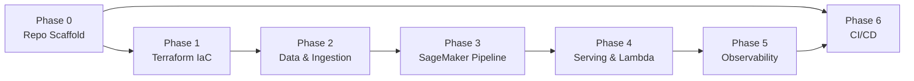

> **Goal:** A production-grade, bilingual (English/Devanagari) Indian Comic History LLM platform on AWS. Website chatbot powered by **Bedrock Qwen3 Next 80B A3B + pgvector RAG** (always-on, no cold start). Fine-tuned Qwen2.5-3B via QLoRA+RAFT retained for benchmarking and MLOps learning. Baseline cost ~$50/mo.

---

## MLOps Pillar Coverage

| Pillar | Status | Notes |
|--------|--------|-------|
| Design, build, and maintain end-to-end MLOps pipelines (training, testing, deployment, monitoring) | ✅ Strong | SageMaker Pipeline DAG: preprocessing → synthesis → training → evaluation → registry |
| Operationalise models using SageMaker (training jobs, pipelines, model registry, real-time endpoints) | ⚠️ Partial | All covered except **batch inference** (Batch Transform not implemented) |
| Support LLM and GenAI workloads (fine-tuning, inference optimisation, deployment patterns) | ✅ Strong | QLoRA fine-tuning, RAFT methodology, 4-bit quantisation, RAG at inference, Bedrock managed serving |
| Develop and maintain CI/CD pipelines for ML workflows | ✅ Strong | `ci.yml` (lint/test), `ct.yml` (continuous training), `deploy.yml` (endpoint), `tf-check.yml` (infra) |
| Monitoring and observability (data drift, model performance, system health) | ⚠️ Partial | SageMaker Experiments + CloudWatch alarms exist; **live data drift and post-deployment model monitoring not implemented** |
| Automate and improve ML development, release, and operational processes | ✅ Strong | Push to main → pipeline → evaluate → register → human approves → auto-deploy |
| Drive continuous improvement in reliability, security, cost, and performance | ✅ Strong | Retry logic, checkpointing, idempotency, KMS, IAM least-privilege, scale-to-zero, 4-bit quantisation |
| Security adherence and compliance (data privacy, model explainability) | ⚠️ Partial | Security strong (KMS, IAM, Secrets Manager, OIDC); **model explainability (SageMaker Clarify) not implemented** |

> **Gaps to address:** (1) Data drift / live model monitoring — emit pgvector similarity scores as CloudWatch metrics from Lambda; (2) Batch inference — document why real-time was chosen or add as a planned item; (3) Model explainability — SageMaker Clarify integration.

---

## Quick Reference: Guiding Constraints

| Constraint | Rule |
|---|---|
| Language | Python 3.12+, strict type hints, pydantic v2 |
| Encoding | UTF-8 everywhere; never strip Devanagari |
| Compute | Serverless where possible; RDS PostgreSQL (db.t4g.micro) is the only persistent resource — justified by pgvector requirement |
| Secrets | AWS Secrets Manager only — no hardcoding |
| IaC | Terraform (primary) — outputs drive all runtime config |
| Encryption | AWS-KMS CMKs on every S3 bucket and RDS instance |
| IAM | Least-privilege, resource-scoped policies |
| Training | On-demand ml.g4dn.xlarge (Spot quota is 0 by default in ap-southeast-2); checkpointing retained |
| Tagging | `Project: Chitrakatha`, `CostCenter: MLOps-Research` on every resource |
| Chunking | Sliding window, 15% overlap for narrative continuity |
| Versioning | S3 bucket versioning enabled on all data buckets |
| Networking | Option B: private RDS + VPC endpoints (Bedrock + Secrets Manager) + custom ECR Docker; no NAT Gateway |

---

## Phase 0 — Repository Scaffold & Governance

**Goal:** Establish the project skeleton, Python toolchain, and pre-commit quality gates before writing any domain code.

### Files to Create

#### `pyproject.toml` [NEW]
- Python 3.12 project config
- Dependencies: `boto3`, `sagemaker`, `pydantic>=2`, `transformers`, `peft`, `trl`, `datasets`, `bitsandbytes`, `yt-dlp`, `openpyxl`, `pytest`, `ruff`, `mypy`
- Dev deps: `moto[s3,bedrock,secretsmanager]`, `pytest-cov`

#### `.python-version` [NEW]
- Pin to `3.12`

#### `.pre-commit-config.yaml` [NEW]
- Hooks: `ruff` (lint + format), `mypy` (type check), `detect-secrets`, `terraform fmt`

#### `Makefile` [NEW]
- Targets: `install`, `lint`, `test`, `tf-plan`, `tf-apply`, `pipeline-run`

#### `src/chitrakatha/__init__.py` [NEW]
- Package init; exposes `__version__`

#### `src/chitrakatha/config.py` [NEW]
- Pydantic v2 `BaseSettings` model: reads `AWS_REGION`, `S3_BUCKET_PREFIX`, `KMS_KEY_ARN`, `SAGEMAKER_ROLE_ARN`, `PGVECTOR_SECRET_ARN` from environment
- No hardcoded values

#### `src/chitrakatha/exceptions.py` [NEW]
- Custom exception hierarchy:
  - `ChitrakathaBaseError`
  - `SageMakerPipelineError(ChitrakathaBaseError)`
  - `BedrockEmbeddingError(ChitrakathaBaseError)` — Titan embedding API failures
  - `BedrockSynthesisError(ChitrakathaBaseError)` — Claude RAFT synthesis failures
  - `PgVectorError(ChitrakathaBaseError)` — replaces `S3VectorError`
  - `DataIngestionError(ChitrakathaBaseError)`

#### `README.md` [NEW]
- Architecture diagram (ASCII), quick-start, cost breakdown

#### `tests/__init__.py`, `tests/unit/__init__.py`, `tests/integration/__init__.py` [NEW]
- Empty init files

---

## Phase 1 — Infrastructure-as-Code (Terraform)

**Goal:** Provision all AWS primitives. Every downstream Python script derives config from Terraform outputs — no hardcoded ARNs.

### Directory: `infra/terraform/`

#### `infra/terraform/main.tf` [EXISTING]
- Provider: `aws ~> 5.x`, `random ~> 3.6` (for RDS password generation)
- Terraform backend: S3 state bucket + DynamoDB lock table

#### `infra/terraform/variables.tf` [UPDATE]
- Existing: `aws_region`, `project_name`, `environment`
- Add: `db_instance_class` (default: `db.t4g.micro`), `db_name` (default: `chitrakatha`)

#### `infra/terraform/kms.tf` [EXISTING]
- Customer Managed Key for all S3 buckets and RDS instance

#### `infra/terraform/s3.tf` [UPDATE]
Provisions **3 S3 buckets** (vectors bucket removed — replaced by pgvector on RDS):
1. `chitrakatha-bronze-{account_id}` — raw ingest (articles, transcripts, Excel)
2. `chitrakatha-silver-{account_id}` — cleaned JSONL
3. `chitrakatha-gold-{account_id}` — training-ready datasets + model artifacts + base model cache

#### `infra/terraform/networking.tf` [UPDATE]
- Existing: VPC (10.0.0.0/16), public subnets (10.0.1.0/24, 10.0.2.0/24), Internet Gateway
- Add: private subnets (10.0.3.0/24, 10.0.4.0/24), private route table (no IGW)
- Add VPC endpoints:
  - `com.amazonaws.{region}.s3` — Gateway endpoint (free); associated with private route table
  - `com.amazonaws.{region}.bedrock-runtime` — Interface endpoint; Lambda calls Bedrock Qwen3 without NAT
  - `com.amazonaws.{region}.secretsmanager` — Interface endpoint; Lambda fetches RDS credentials at runtime
- Add security group for VPC endpoints (allow HTTPS from VPC CIDR)

#### `infra/terraform/rds.tf` [NEW]
- `random_password` resource — 32-char alphanumeric RDS password
- `aws_security_group.rds` — allow port 5432 from Lambda security group only
- `aws_security_group.lambda` — allow all outbound (reaches RDS + VPC endpoints)
- `aws_db_subnet_group` — private subnets only
- `aws_db_instance` — PostgreSQL 16, `db.t4g.micro`, 20GB gp3, KMS-encrypted, `publicly_accessible = false`
- `aws_secretsmanager_secret.rds_credentials` — stores `{host, port, dbname, username, password}` as JSON

#### `infra/terraform/pgvector.tf` [NEW — replaces faiss_index.tf]
- Locals defining pgvector table name and index configuration
- `null_resource` to run schema init SQL via psql after RDS is provisioned:
  ```sql
  CREATE EXTENSION IF NOT EXISTS vector;
  CREATE TABLE IF NOT EXISTS embeddings (
    id BIGSERIAL PRIMARY KEY,
    chunk_id TEXT UNIQUE NOT NULL,
    chunk_text TEXT NOT NULL,
    source_document TEXT NOT NULL,
    chunk_index INTEGER NOT NULL,
    token_count INTEGER NOT NULL,
    embedding vector(1024)
  );
  CREATE INDEX IF NOT EXISTS embeddings_hnsw_idx
    ON embeddings USING hnsw (embedding vector_cosine_ops);
  ```

#### `infra/terraform/iam.tf` [UPDATE]
- SageMaker role:
  - Remove: `S3ReadJumpStartPrivateCache` statement (no longer using JumpStart)
  - Remove: vectors bucket ARN from `S3ReadWriteProjectBuckets`
  - Retain: Bedrock permissions for Titan Embed + Claude 3.5 Sonnet synthesis
- Lambda role:
  - Remove: `sagemaker:InvokeEndpoint` (Lambda calls Bedrock directly now)
  - Add: `bedrock:InvokeModel` + `bedrock:InvokeModelWithResponseStream` for Qwen3 Next 80B A3B + Titan Embed
  - Add: `secretsmanager:GetSecretValue` scoped to `chitrakatha/rds_credentials`
  - Add: `ec2:CreateNetworkInterface`, `ec2:DeleteNetworkInterface`, `ec2:DescribeNetworkInterfaces` (Lambda in VPC requirement)

#### `infra/terraform/secrets.tf` [EXISTING]
- Existing: `chitrakatha/synthetic_data_api_key` for Claude synthesis
- RDS credentials secret is managed in `rds.tf`

#### `infra/terraform/outputs.tf` [UPDATE]
- Remove: `s3_vectors_bucket`, `s3_vectors_bucket_arn`, `s3_faiss_index_prefix`
- Add: `rds_endpoint`, `rds_secret_arn`, `lambda_security_group_id`, `private_subnet_ids`

#### `infra/terraform/lambda.tf` [UPDATE]
- Add `vpc_config` block: private subnets + Lambda security group
- Update env vars: replace `SAGEMAKER_ENDPOINT_NAME` with `DB_SECRET_ARN`, `BEDROCK_QWEN3_MODEL_ID`
- Increase timeout to 60s (pgvector retrieval + Bedrock generation)
- Add `depends_on` for VPC endpoints (Lambda must not start before endpoints are ready)

#### `infra/terraform/cloudwatch.tf` [EXISTING]
- CloudWatch Dashboard: `ChitrakathaMLOpsDashboard`
- Widgets: Lambda invocations, error rate, Bedrock latency, training job status

#### `infra/terraform/github_oidc.tf` [EXISTING]
- OIDC role for GitHub Actions — no changes required

---

## Phase 2 — Data Layer & Ingestion Pipeline

**Goal:** Accept raw source material only — the pipeline handles everything else. Two parallel flows serve different purposes: **Flow A** builds the pgvector knowledge base; **Flow B** auto-generates fine-tuning training pairs from that same corpus via Claude.

> [!NOTE]
> **You never write Q&A pairs manually.** You drop raw data in. Claude reads each chunk and synthesises bilingual training examples automatically.

### Data Sources (what you provide)

| Source type | Format | Drop location |
|---|---|---|
| Comic wiki / blog articles | `.txt`, `.md` | `s3://chitrakatha-bronze/articles/` |
| YouTube transcripts | `.vtt`, `.txt` | `s3://chitrakatha-bronze/transcripts/` |
| Excel metadata sheets | `.xlsx` | `s3://chitrakatha-bronze/metadata/` |
| Scanned comic synopsis | `.txt` (UTF-8) | `s3://chitrakatha-bronze/synopsis/` |

### Sub-phase 2a: Raw Ingestion → S3 Bronze

#### `data/scripts/upload_to_bronze.py` [EXISTING]
- Generic S3 upload utility for all raw source types above
- Validates UTF-8 encoding before upload; preserves Devanagari
- Computes MD5 checksum stored in S3 object metadata for lineage

### Sub-phase 2b: Preprocessing & Dual-Flow Split

After raw data lands in Bronze, **one preprocessing job** produces two outputs:

```
S3 Bronze (raw)
      │
  preprocessing.py
      │
      ├──► S3 Silver /corpus/     ← Flow A: clean chunks for RAG
      └──► S3 Silver /training/   ← Flow B: input for Q&A synthesis
```

### Sub-phase 2c: Flow A — Corpus → pgvector (RAG knowledge base)

#### `src/chitrakatha/ingestion/chunker.py` [EXISTING]
- Sliding-window chunker with 15% overlap
- Preserves Devanagari; never strips non-ASCII

#### `src/chitrakatha/ingestion/embedder.py` [EXISTING]
- Wraps Bedrock `amazon.titan-embed-text-v2:0`
- Batch-embeds chunks (max 25 per API call)
- Returns `list[float]` (1024-dim vectors)

#### `src/chitrakatha/ingestion/pgvector_writer.py` [NEW — replaces faiss_writer.py]
- Writes `(chunk_id, chunk_text, source_document, chunk_index, token_count, embedding)` to RDS pgvector
- Connects via credentials fetched from Secrets Manager (`chitrakatha/rds_credentials`)
- Idempotent: uses `INSERT ... ON CONFLICT (chunk_id) DO UPDATE` — safe to re-run
- Raises `PgVectorError` on connection or insert failure

### Sub-phase 2d: Flow B — Corpus → RAFT Training Data → Fine-tuning

> **Technique: RAFT (Retrieval-Augmented Fine-Tuning)**
> The model is trained not just on Q&A facts, but on examples that include a golden document *and* distractor documents. This teaches the model the skill of reading retrieved context and ignoring irrelevant chunks — exactly what it must do at inference time against live pgvector results.

#### `data/scripts/synthesize_training_pairs.py` [EXISTING]
- Reads clean corpus chunks from `S3 Silver /training/`
- For each golden chunk, randomly samples 2 distractor chunks from different `source_document` values
- Calls Bedrock Claude 3.5 Sonnet v2 with a RAFT prompt
- Output schema per record:
  ```json
  {
    "id": "uuid4",
    "question_en": "...",
    "question_hi": "... (Devanagari)",
    "golden_chunk": "...",
    "distractor_chunks": ["...", "..."],
    "chain_of_thought": "...",
    "answer_en": "...",
    "answer_hi": "...",
    "source_chunk_id": "...",
    "language_pair": "en-hi"
  }
  ```
- Output: JSONL to `S3 Gold /training-pairs/`

---

## Phase 3 — SageMaker MLOps Pipeline (The Core DAG)

**Goal:** Build the automated `Process → Embed → Train → Evaluate → Register` pipeline.

### Sub-phase 3a: Processing Step

#### `pipeline/steps/preprocessing.py` [EXISTING]
- SageMaker Processing script (runs in `SKLearnProcessor`)
- Input: raw source files from S3 Bronze
- Output: `S3 Silver /corpus/` (Flow A) + `S3 Silver /training/` (Flow B)

### Sub-phase 3b: Embedding Step (Flow A)

#### `pipeline/steps/embed_and_index.py` [UPDATE]
- SageMaker Processing script
- Reads `S3 Silver /corpus/` → chunk → embed via Titan Embed v2 → **insert into pgvector** (replaces FAISS S3 upload)
- Connects to RDS via credentials from Secrets Manager
- Logs vector count to SageMaker Experiments

### Sub-phase 3b-ii: Training Pair Synthesis Step (Flow B)

#### `pipeline/steps/synthesize_pairs.py` [EXISTING]
- SageMaker Processing script wrapping `synthesize_training_pairs.py`
- Reads `S3 Silver /training/` corpus chunks
- Claude 3.5 Sonnet v2 generates 3 bilingual Q&A pairs per chunk
- Outputs to `S3 Gold /training-pairs/`
- **Runs in parallel with `embed_and_index.py`** (no dependency between Flow A and Flow B)

### Sub-phase 3c: Fine-tuning Step

#### `pipeline/steps/train.py` [EXISTING]
- **QLoRA fine-tuning** using `trl.SFTTrainer` (pinned to 0.8.6) + `peft` with RAFT prompt template
- Base model: `Qwen/Qwen2.5-3B-Instruct` (Apache 2.0) — loaded from **S3 Gold `/base-models/qwen2.5-3b-instruct/`** via `SM_CHANNEL_MODEL` (not downloaded from HuggingFace at runtime)
- LoRA config: `r=16`, `lora_alpha=32`, `target_modules=["q_proj","v_proj"]`, `lora_dropout=0.05`
- Quantization: 4-bit `BitsAndBytesConfig` (NF4, float16 for T4 GPU)
- **On-demand training**: `use_spot_instances=False` (Spot quota is 0 in ap-southeast-2)
- Checkpointing to S3 Gold (`/checkpoints/`)
- LoRA adapters merged into base model weights before saving (plain `AutoModelForCausalLM` at serving time)
- Logs hyperparameters + eval metrics to SageMaker Experiments

#### `pipeline/steps/evaluate.py` [EXISTING]
- Three test suites: factual accuracy (ROUGE-L, BERTScore), cross-lingual retrieval, distractor robustness
- Pass threshold: ROUGE-L ≥ 0.35 **AND** distractor_robustness ≥ 0.70

#### `pipeline/Dockerfile` [NEW]
- Custom ECR training image with all `pipeline/requirements.txt` deps pre-baked at build time
- Base: `763104351884.dkr.ecr.{region}.amazonaws.com/huggingface-pytorch-training:2.1.0-transformers4.40-gpu-py310-cu121-ubuntu20.04`
- Eliminates runtime `pip install`; rebuilt only when `requirements.txt` changes
- Pushed to ECR by `ct.yml` before pipeline execution

#### `pipeline/requirements.txt` [EXISTING — pinned]
- All versions exact-pinned: `trl==0.8.6`, `transformers==4.40.0`, `torch==2.1.0`, `peft==0.10.0`, etc.
- Pinned to prevent breaking API changes on every training run

### Sub-phase 3d: Pipeline DAG

#### `pipeline/pipeline.py` [EXISTING]
- `sagemaker.workflow.pipeline.Pipeline` definition using `PipelineSession`
- Steps in order:
  1. `ProcessingStep` — `preprocessing.py` via `SKLearnProcessor`
  2. `ProcessingStep` — `embed_and_index.py` (Flow A: corpus → pgvector) ┐ parallel
  3. `ProcessingStep` — `synthesize_pairs.py` (Flow B: chunks → Gold Q&A) ┘
  4. `TrainingStep` — `train.py` via `HuggingFace` estimator with custom ECR image; `SM_CHANNEL_MODEL` mounts base model from `s3://chitrakatha-gold/base-models/qwen2.5-3b-instruct/`
  5. `ProcessingStep` — `evaluate.py`
  6. `ConditionStep` — if ROUGE-L ≥ 0.35 AND distractor_robustness ≥ 0.70 → register
  7. `ModelStep` — creates SageMaker Model artifact
  8. `RegisterModel` — registers to Model Registry (`PendingManualApproval`)
- `source_dir` is NOT used in `processor.run()` calls — `chitrakatha` library synced to S3 and mounted via `ProcessingInput`; `PYTHONPATH=/opt/ml/processing/input/src`

---

## Phase 4 — Serving: Bedrock Qwen3 Next 80B A3B + pgvector RAG

**Goal:** Always-on chatbot API with no GPU cold start. Bedrock Qwen3 Next 80B A3B handles generation; pgvector on RDS handles retrieval. Fine-tuned Qwen model retained in Model Registry for benchmarking only.

### Sub-phase 4a: Inference Logic

#### `serving/inference.py` [REWRITE]
- **Benchmarking SageMaker endpoint entry point** — not part of the production serving path
- Fine-tuned Qwen2.5-3B model loaded via `model_fn()` (4-bit NF4 on GPU, bfloat16 on CPU)
- RAG flow in `predict_fn()`:
  1. Embed query using Bedrock Titan Embed v2 (1024-dim)
  2. Query pgvector via `SELECT chunk_text, source_document FROM embeddings ORDER BY embedding <=> %s::vector LIMIT 5`
  3. Build prompt with retrieved chunks as context
  4. Generate answer with the fine-tuned Qwen2.5-3B via HuggingFace `pipeline("text-generation")`
- Credentials fetched from Secrets Manager per request (no persistent connection at module level)

#### `serving/deploy_endpoint.py` [BENCHMARKING ONLY]
- **Not part of the live serving path**
- Used on-demand to deploy the fine-tuned Qwen model to a SageMaker real-time endpoint for quality benchmarking
- Endpoint scaled to 0 when not actively benchmarking

### Sub-phase 4b: Lambda Bridge

#### `serving/lambda/handler.py` [UPDATE]
- Python 3.12 Lambda function; runs inside VPC (private subnets)
- API Gateway → Lambda → pgvector retrieval + Bedrock Qwen3 generation
- **Request/response contract:**
  ```json
  // Request
  { "query": "Who created Nagraj?" }
  // Response
  { "answer": "Nagraj was created by...", "language": "en", "sources": ["raj_comics_1990.txt"] }
  ```
- Language detection: Devanagari chars (`[\u0900-\u097F]`) → `language: "hi"`; otherwise `"en"`
- No-chunks fallback: returns 200 with fallback message and `sources: []`
- Sources deduplicated: `sorted({c["source_document"] for c in chunks})`
- Module-level `bedrock` and `sm_client` Boto3 clients (reused across warm invocations)
- Removed 503 cold start logic (no SageMaker endpoint in hot path)

#### `serving/lambda/requirements.txt` [UPDATE]
- Add: `psycopg2-binary`, `pgvector`
- Retain: `boto3`, `pydantic>=2`

#### `infra/terraform/lambda.tf` [UPDATE]
- Lambda in VPC: `vpc_config` with private subnets + Lambda security group
- Env vars: `DB_SECRET_ARN`, `BEDROCK_QWEN3_MODEL_ID`, `BEDROCK_EMBED_MODEL_ID`
- Timeout: 60s

---

## Phase 5 — Observability, Lineage & MLOps Governance

**Goal:** Full experiment tracking, data-to-model lineage, and CloudWatch dashboards.

#### `src/chitrakatha/monitoring/lineage.py` [EXISTING]
- Wraps `sagemaker.lineage` APIs
- Records: `DataSet → ProcessingJob → TrainingJob → Model` lineage chain

#### `src/chitrakatha/monitoring/experiments.py` [EXISTING]
- Helper to log to SageMaker Experiments
- Logs: `base_model`, `lora_r`, `lora_alpha`, `learning_rate`, `epochs`, `rouge_l`, `bert_score`

#### `infra/terraform/cloudwatch.tf` [EXISTING]
- Dashboard widgets: Lambda invocations, error rate, Bedrock latency P99, training job status

---

## Phase 6 — CI/CD (GitHub Actions)

**Goal:** Automated quality gates and pipeline triggering on every PR and merge to `main`.

#### `.github/workflows/ci.yml` [EXISTING]
- `ruff check`, `ruff format --check`, `mypy src/`, `pytest tests/unit/`

#### `.github/workflows/ct.yml` [UPDATE]
- On push to `main`: build + push ECR Docker image (if `pipeline/requirements.txt` changed), then run `pipeline/pipeline.py --execute`
- Assumes OIDC role; fetches Terraform outputs as env vars

#### `.github/workflows/deploy.yml` [EXISTING]
- Manual trigger for benchmarking: runs `serving/deploy_endpoint.py`
- Note: endpoint is for benchmarking only, not live traffic

#### `.github/workflows/tf-check.yml` [EXISTING]
- `terraform fmt -check`, `terraform validate`, `tfsec` on infra changes

---

## Repository Layout

```
sagemaker-project-chitrakatha/
├── .github/workflows/
│   ├── ci.yml
│   ├── ct.yml
│   ├── deploy.yml
│   └── tf-check.yml
├── .pre-commit-config.yaml
├── Makefile
├── README.md
├── pyproject.toml
├── .python-version
│
├── infra/terraform/
│   ├── main.tf
│   ├── variables.tf
│   ├── kms.tf
│   ├── s3.tf
│   ├── networking.tf         # VPC + public/private subnets + VPC endpoints
│   ├── rds.tf                # RDS PostgreSQL + pgvector security groups + credentials
│   ├── pgvector.tf           # pgvector schema init (replaces faiss_index.tf)
│   ├── iam.tf
│   ├── secrets.tf
│   ├── cloudwatch.tf
│   ├── lambda.tf
│   ├── studio.tf
│   ├── github_oidc.tf
│   └── outputs.tf
│
├── src/chitrakatha/
│   ├── __init__.py
│   ├── config.py
│   ├── exceptions.py
│   ├── ingestion/
│   │   ├── chunker.py
│   │   ├── embedder.py
│   │   └── pgvector_writer.py    # replaces faiss_writer.py
│   └── monitoring/
│       ├── lineage.py
│       └── experiments.py
│
├── pipeline/
│   ├── pipeline.py
│   ├── Dockerfile                # custom ECR training image
│   ├── requirements.txt          # exact-pinned versions
│   └── steps/
│       ├── preprocessing.py
│       ├── embed_and_index.py    # updated: FAISS → pgvector
│       ├── synthesize_pairs.py
│       ├── train.py
│       └── evaluate.py
│
├── serving/
│   ├── deploy_endpoint.py        # benchmarking only (not live serving)
│   ├── inference.py              # rewritten: pgvector + Bedrock Qwen3
│   └── lambda/
│       ├── handler.py
│       └── requirements.txt
│
├── data/scripts/
│   ├── upload_to_bronze.py
│   └── synthesize_training_pairs.py
│
└── tests/
    ├── unit/
    │   ├── test_chunker.py
    │   ├── test_embedder.py
    │   ├── test_preprocessor.py
    │   ├── test_pgvector_writer.py   # replaces test_faiss_writer.py
    │   └── test_lambda_handler.py
    └── integration/
        └── test_pipeline_dag.py
```

---

## Cleanup — Remove Before / During Implementation

Everything below must be cleaned up as part of the migration. Nothing here should exist in the final architecture.

### Terraform — remove resources

- [ ] `infra/terraform/s3.tf` — delete S3 Vectors bucket resource + lifecycle policy + versioning config (remove `prevent_destroy = true` first, then `terraform destroy` the bucket after emptying it)
- [ ] `infra/terraform/faiss_index.tf` — delete entire file; replaced by `pgvector.tf`
- [ ] `infra/terraform/outputs.tf` — remove `s3_vectors_bucket`, `s3_vectors_bucket_arn`, `s3_faiss_index_prefix` outputs
- [ ] `infra/terraform/iam.tf` — remove vectors bucket ARN from `S3ReadWriteProjectBuckets` statement in SageMaker role
- [ ] `infra/terraform/iam.tf` — remove `S3ReadJumpStartPrivateCache` statement (no longer using JumpStart)
- [ ] `infra/terraform/iam.tf` — remove `sagemaker:InvokeEndpoint` from Lambda policy (Lambda calls Bedrock now)
- [ ] `infra/terraform/lambda.tf` — remove `SAGEMAKER_ENDPOINT_NAME` env var from Lambda function

### Code — delete files entirely

- [ ] `src/chitrakatha/ingestion/faiss_writer.py` — replaced by `pgvector_writer.py`
- [ ] `data/scripts/ingest_to_faiss.py` — Flow A orchestration script for FAISS; replaced by pgvector insert in `embed_and_index.py`
- [ ] `tests/unit/test_faiss_writer.py` — replaced by `tests/unit/test_pgvector_writer.py`

### Code — keep but repurpose

- [ ] `serving/deploy_endpoint.py` — remove from live serving path; keep for on-demand benchmarking only (deploy fine-tuned Qwen, compare vs Qwen3 RAG, scale back to 0)

### Code — rewrite in place

- [ ] `serving/inference.py` — Qwen generation → Bedrock Qwen3 Next 80B A3B + pgvector retrieval
- [ ] `serving/lambda/handler.py` — new request/response contract + Bedrock call; remove 503 cold start logic
- [ ] `pipeline/steps/embed_and_index.py` — FAISS S3 upload → pgvector insert
- [ ] `src/chitrakatha/exceptions.py` — rename `S3VectorError` → `PgVectorError`

### Manual AWS cleanup (one-time, after Terraform changes)

- [ ] Empty S3 Vectors bucket before destroying (Terraform cannot destroy non-empty buckets)
- [ ] Delete SageMaker real-time endpoint if currently deployed (not needed for live traffic; spin up on-demand for benchmarking only)

---

## Phase Execution Order & Dependencies



---

## Key Decisions

| # | Decision | Options Considered | **Decision** |
|---|---|---|---|
| 1 | **Base LLM** | Llama 3.2 3B (JumpStart) vs Qwen2.5-3B (HuggingFace) | ✅ **Qwen2.5-3B-Instruct** — better Hindi/Devanagari, Apache 2.0 (no approval), JumpStart was brittle |
| 2 | **Base model source** | HuggingFace Hub (external, runtime) vs S3 cache | ✅ **S3 Gold bucket** — cached once at `s3://chitrakatha-gold/base-models/qwen2.5-3b-instruct/`, passed as `SM_CHANNEL_MODEL`; removes external dependency |
| 3 | **Training instance** | Spot `ml.g4dn.xlarge` vs on-demand | ✅ **On-demand** — Spot quota is 0 in ap-southeast-2 |
| 4 | **Q&A pairs per chunk** | 3 vs 5 | ✅ **3 pairs** — keeps Bedrock cost low while scaling with corpus size |
| 5 | **IaC tool** | Terraform vs CDK | ✅ **Terraform** |
| 6 | **Vector store** | FAISS-on-S3 vs pgvector vs OpenSearch | ✅ **pgvector on RDS PostgreSQL** — hybrid search (vector + SQL filters), concurrent writes, AWS-native, open source; no cold start for RAG retrieval |
| 7 | **Website chatbot serving** | SageMaker GPU endpoint (fine-tuned Qwen) vs Bedrock Qwen3 + RAG | ✅ **Bedrock Qwen3 Next 80B A3B + pgvector RAG** — no GPU cold start, no standing GPU cost, works in ap-southeast-2, stronger Hindi than Claude models available in region |
| 8 | **Fine-tuned Qwen role** | Production serving vs benchmarking only | ✅ **Benchmarking only** — model trained via QLoRA+RAFT pipeline; deployed on-demand to compare quality vs Qwen3 RAG; not in live serving path |
| 9 | **Networking** | Public RDS vs private + NAT Gateway vs private + VPC endpoints | ✅ **Option B: private RDS + VPC endpoints** — no NAT Gateway (~$55 AUD/month saved); custom ECR Docker pre-bakes deps; most secure |
| 10 | **Training container** | SageMaker-managed (runtime pip install) vs custom ECR image | ✅ **Custom ECR image** — eliminates supply chain risk, reproducible, rebuilt only when `requirements.txt` changes |
