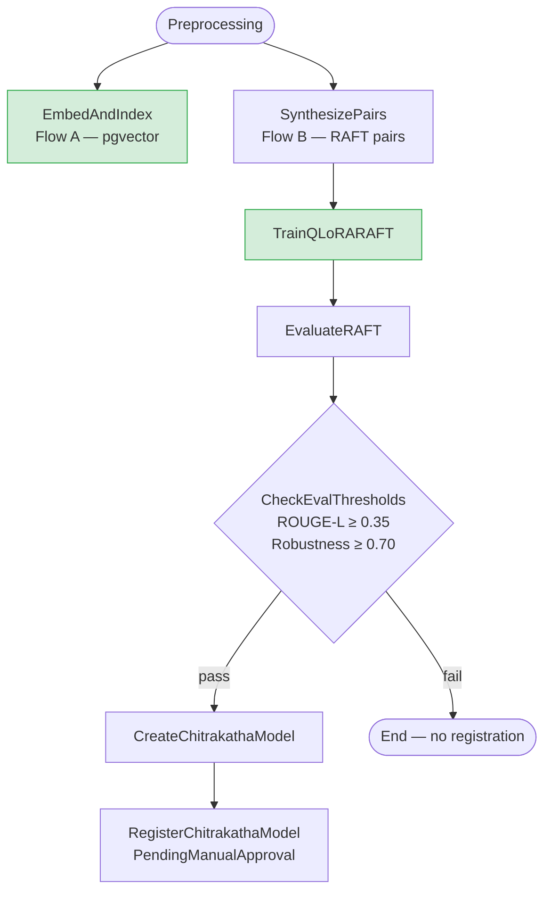

# Pipeline DAG

Two independent flows branch after `Preprocessing` and never block each other.

**Flow A** (`EmbedAndIndex`): completes independently → Lambda RAG inference works as soon as this step finishes.

**Flow B** (`SynthesizePairs → TrainQLoRARAFT → EvaluateRAFT → ...`): fine-tuning path, runs in parallel with Flow A and proceeds regardless of embedding outcome.
